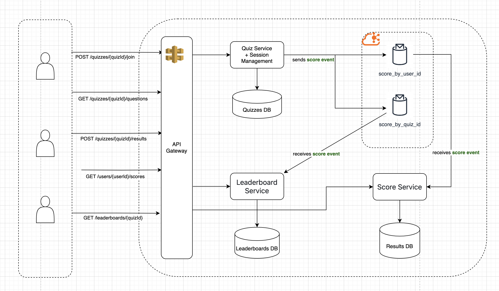

# Real-Time Vocabulary Quiz System Design

## 1. Architecture Diagram



Refer to the provided `diagram1.png` diagram which visually represents the real-time English quiz system. The architecture follows a service-oriented design with a RESTful API gateway and event-driven components using Kafka for decoupled communication.

## 2. Component Descriptions

### 2.1 Client Applications

* **Web and Mobile Apps**: Allow users to register, join quizzes, answer questions, and view scores/leaderboards in real time.

### 2.2 API Gateway

* Central entry point for all client requests.
* Routes requests to appropriate backend services.
* Handles authentication, rate limiting, and logging.

### 2.3 Quiz Service

* Manages quiz session lifecycle: creating sessions, tracking active users, and broadcasting quiz questions.
* Handles real-time interactions and synchronization using WebSocket.
* Accepts quiz result submissions, calculates scores, and publishes them to Kafka (`score_event`).

### 2.4 Kafka

* Facilitates asynchronous and decoupled communication between services.
* Topics:

    * `score_event`: Carries scored quiz results from the Quiz Service.

### 2.5 Score Service

* Consumes `score_event` events.
* Stores scored results to Results DB.
* Optionally performs analytics or validation.

### 2.6 Leaderboard Service

* Consumes `score_event` events.
* Updates leaderboard state in memory or cache.
* Responds to API calls for leaderboard queries.

### 2.7 Databases

* **Quizzes DB**: Stores quiz templates, question banks, and session metadata.
* **Results DB**: Stores individual user scores and submission history.
* **Leaderboards DB**: Stores ranked scores per quiz session.

## 3. Data Flow

1. **User joins a quiz**:

    * `POST /quizzes/{quizId}/join` → Quiz Service registers the session.

2. **Fetching questions**:

    * `GET /quizzes/{quizId}/questions` → Quiz Service returns the current question set.

3. **Submitting answers**:

    * `POST /quizzes/{quizId}/results` → Quiz Service calculates the score and publishes to Kafka (`score_event`).

4. **Scoring and Leaderboard updates**:

    * Score Service consumes `score_event`, stores results in Results DB.
    * Leaderboard Service consumes `score_event`, updates leaderboard state.

5. **User views scores**:

    * `GET /users/{userId}/scores` → Score Service queries Results DB.

6. **User views leaderboard**:

    * `GET /leaderboards/{quizId}` → Leaderboard Service queries leaderboard data.

## 4. Technology Justification

| Technology                | Purpose               | Justification                                                              |
| ------------------------- | --------------------- | -------------------------------------------------------------------------- |
| **React / Flutter**       | Frontend (Web/Mobile) | Enables cross-platform UIs and real-time user interaction.                 |
| **Node.js / Spring Boot** | Backend services      | Scalable and performant for real-time APIs.                                |
| **Redis**                 | Session state store   | Fast, in-memory store for session and timer tracking.                      |
| **Kafka**                 | Event streaming       | Enables decoupling between scoring and leaderboard logic.                  |
| **PostgreSQL / MongoDB**  | Persistent storage    | Relational or document-based storage depending on schema needs.            |
| **WebSocket / Socket.IO** | Real-time sync        | Ensures low-latency interaction between server and clients during quizzes. |
| **Docker / Kubernetes**   | Deployment            | Supports scalable and containerized service deployments.                   |

## 5. Sequence Diagrams

### 5.1 Quiz Participation

```
User → API Gateway: POST /quizzes/{quizId}/join
API Gateway → Quiz Service: join request
Quiz Service → Session Store (Redis): create session state
Quiz Service → API Gateway → User: success response
```

### 5.2 Answer Submission and Scoring

```
User → API Gateway: POST /quizzes/{quizId}/results
API Gateway → Quiz Service: submit answers
Quiz Service → Quiz Service: calculate score
Quiz Service → Kafka (score_event): publish score
Kafka → Score Service: consume score_event
Score Service → Results DB: store result
Kafka → Leaderboard Service: consume score_event
Leaderboard Service → Leaderboard DB: update leaderboard
```

### 5.3 Leaderboard Retrieval

```
User → API Gateway: GET /leaderboards/{quizId}
API Gateway → Leaderboard Service: fetch request
Leaderboard Service → Leaderboard DB or Cache: query rankings
Leaderboard Service → API Gateway → User: return leaderboard
```

## 6. Sharding and Scalability Plans

### 6.0 Infrastructure-Managed Sharding

Wherever possible, the system leverages sharding that is independent of application logic. This is achieved through the following strategies:

* **Shard-aware proxies or middleware** (e.g., Citus for PostgreSQL, Vitess for MySQL) to abstract partitioning logic from application code.
* **Service mesh or DNS-based routing** to dynamically route traffic to appropriate DB shards or Kafka partitions using headers, environment variables, or request metadata.
* **Kafka partitioning** is handled by producer configurations using keys like `quizId`, so that consuming services do not handle partition logic.
* **Shard configuration and lookup** can be stored in service discovery or environment configuration, managed by DevOps. Application code remains unaware of physical shard topology.
* **Stateless SDKs or drivers** (e.g., Redis Cluster clients, Cassandra drivers) manage partitioning transparently.

This approach ensures clean separation between infrastructure and application concerns, reducing complexity for developers while maintaining scalable architecture.

### 6.1 Database Sharding

* **Quizzes DB and Leaderboards DB** should be sharded by `quizId` to localize access patterns by session.
* **Results DB** should be sharded by `userId` to optimize historical query access and load distribution per user.
* Use consistent hashing to allocate keys to shards.

### 6.2 Kafka Partitioning

To optimize processing for different consumer access patterns, the system uses **two Kafka topics for scored quiz results**:

* `score_event_by_quiz`: Partitioned by `quizId`, consumed by the Leaderboard Service for fast per-quiz updates.
* `score_event_by_user`: Partitioned by `userId`, consumed by the Score Service for efficient per-user result storage and queries.

This dual-topic strategy ensures each consumer service receives events in a partitioning scheme that aligns with its scaling and access needs, while maintaining independence and performance across services.

Producers in the Quiz Service publish the same event payload to both topics using different keys:

```ts
kafkaProducer.send('score_event_by_quiz', {
  key: quizId,
  value: scorePayload,
});

kafkaProducer.send('score_event_by_user', {
  key: userId,
  value: scorePayload,
});
```

* Kafka topics like `score_event` will be partitioned by `quizId` to allow parallel processing.

### 6.3 Stateless Microservices

* Services are stateless and horizontally scalable.
* Session state stored in Redis clusters.

### 6.4 Autoscaling

* Use Kubernetes HPA (Horizontal Pod Autoscaler) based on CPU/memory or queue length (Kafka lag).

## 7. Non-Functional Requirements

### 7.1 Performance

* Handle up to 100k concurrent quiz participants.
* <100ms latency for question broadcast.
* <500ms end-to-end delay from answer to leaderboard update.

### 7.2 Availability

* Target 99.99% uptime.
* Redundant Kafka brokers and database replicas.

### 7.3 Security

* JWT-based authentication for all APIs.
* Role-based access control (RBAC) for admin endpoints.
* HTTPS enforced across all services.
* WebSocket secured with token-based validation.

### 7.4 Monitoring & Logging

* Prometheus + Grafana for system metrics.
* ELK Stack for centralized logging.
* Kafka lag, Redis TTL, DB health continuously monitored.

---

This system is designed to be scalable, maintainable, secure, and responsive under high concurrency. Future enhancements may include cross-region deployment, personalized leaderboards, and real-time cheating detection.
